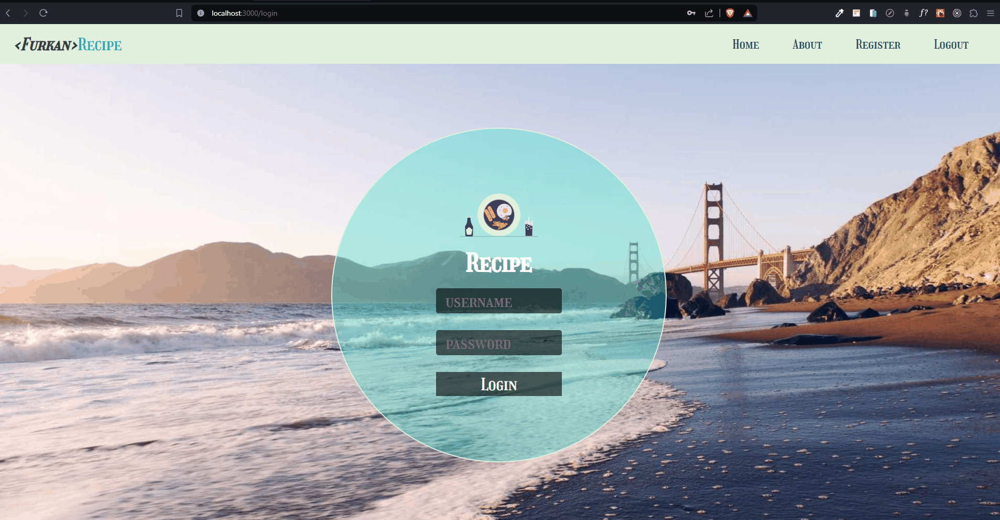
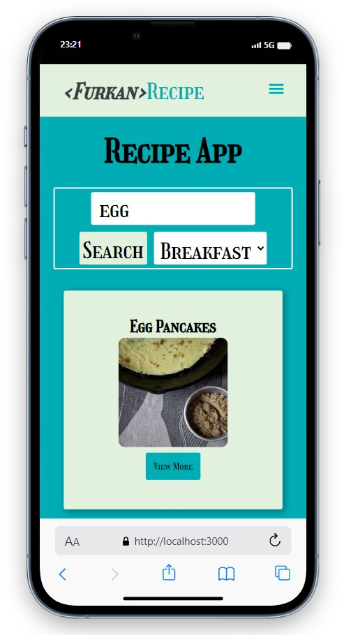
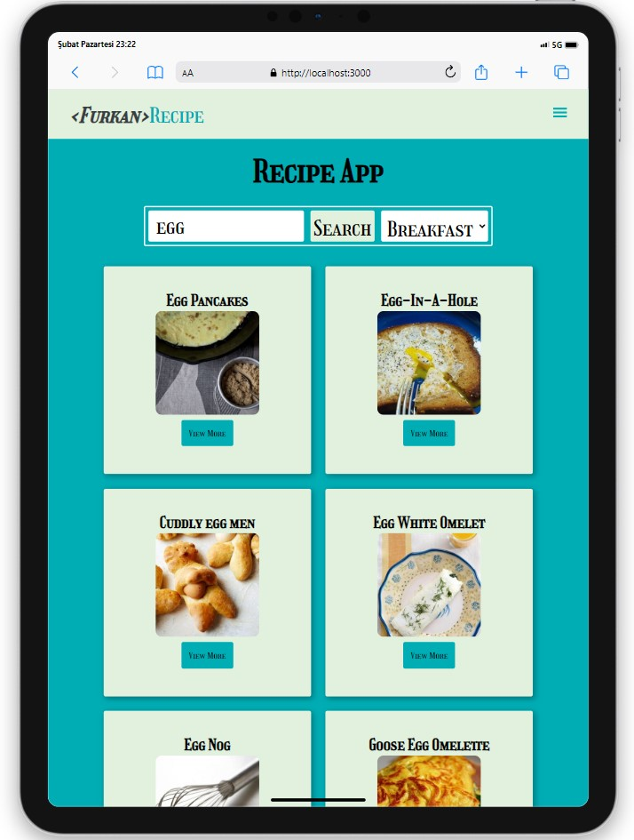
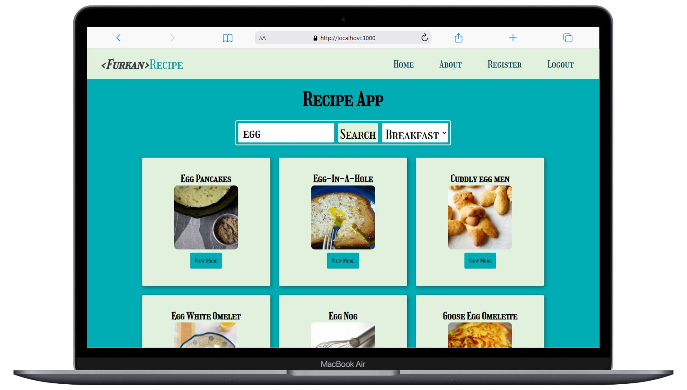

# Recipe App

<div align="center">
  
</div>

## About the Project

This project I created with React is a web application where users can discover various recipes for breakfast, lunch, dinner, snack and teatime.

## Table of Contents

- [Features](#features)
- [Technologies Used](#technologies-used)
- [Usage](#usage)
- [Project Skeleton](#project-skeleton)
- [Screenshots](#screenshots)

## Live Demo

[Recipe App](https://recipe-app-dun.vercel.app/)

## Features

- Logging in with email and password information
- Pagination for smooth transitions between pages.
- Easy recipe search using the filtering feature.

## Technologies Used

- React
- Axios for API requests
- React-Router-Dom
- [Edamam API](https://developer.edamam.com/edamam-recipe-api) for recipe data
- Icons from [React Icons](https://react-icons.github.io/react-icons/)
- Styling with [Styled Components](https://styled-components.com/)

## Usage

- When you hover over the email and password fields in the login section, the login email address and password are visible.
- Access detailed information and reviews for each recipe.
- Use the search function to find specific recipes.

## Project Skeleton

```
Recipe App (folder)
|
|----readme.md         
SOLUTION
├── public
│    └── index.html
├── src
│    ├── assets
│    │     └── [images]
│    ├── components
│    │     ├── cards
│    │     │    ├── Cards.jsx    
│    │     │    └── Cards.style.jsx 
│    │     ├── globalStyles
│    │     │    ├── Flex.jsx    
│    │     │    ├── Global.style.jsx    
│    │     │    └── theme.js
│    │     ├── header 
│    │     │    ├── Header.jsx    
│    │     │    └── Header.style.jsx    
│    │     └── nav 
│    │          ├── Navbar.jsx    
│    │          └── Navbar.style.jsx  
│    ├── pages
│    │     ├── about
│    │     │    ├── About.jsx    
│    │     │    └── About.style.jsx 
│    │     ├── detail
│    │     │    ├── Detail.jsx        
│    │     │    └── Detail.style.jsx
│    │     ├── home 
│    │     │    ├── Home.jsx    
│    │     │    └── Home.style.jsx    
│    │     ├── login 
│    │     │    ├── Login.jsx    
│    │     │    └── Login.style.jsx    
│    │     └── register    
│    │          └── Register.jsx  
│    ├── router
│    │     ├── AppRouter.jsx
│    │     └── PrivateRouter.jsx
│    ├── App.js
│    └── index.js
├── package.json
└── yarn.lock
```

## Screenshots

<div align="center">
  
  
  
</div>

## Compatibility

The project is compatible with both wide-screen computers and mobile devices.

## Acknowledgments

Recipes data provided by [Edamam API](https://developer.edamam.com/edamam-recipe-api)